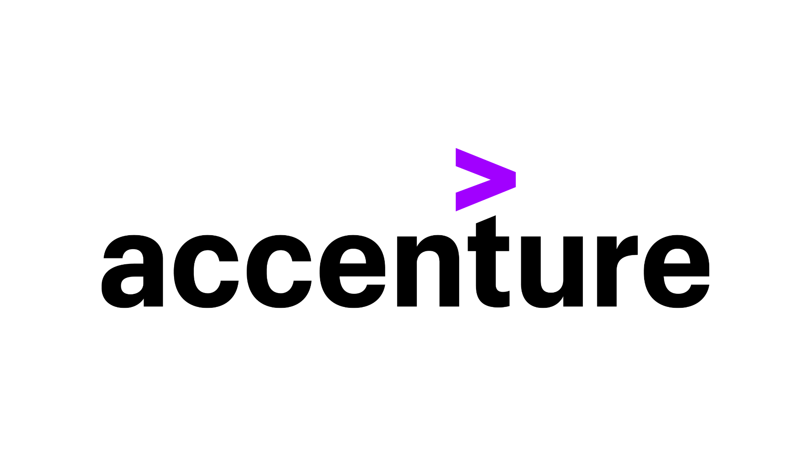

# Data Analyst Job Simulation Role in Accenture

## Introduction:

    As a beginner trying to get a job in tech, my resume/certifications is usually not enough. So the best option to showcase my skills is through projects and even better a job simulation.  
    Thankfully, there are online platforms such as <a href="https://www.theforage.com">The Forage</a> that partner with various industries to offer participants virtual work experience programs that provide them with practical skills and exposure to real-world tasks to help build their resumes and professional network. 

  

    The industry in this case is <a href="https://www.accenture.com/us-en/careers/life-at-accenture/entry-level">Accenture</a>. 
    Operating in over 120 countries, is a professional services firm that provides consulting, technology, and outsourcing services to clients accross a wide range of industries, including technology, financial services, healthcare, and communications.

## Aim of the Project: 

    The aim of the project is to showcase my data analytical skills - using tools such as SQL, Excel to solve a real world task.

<!-- 

  

 -->
